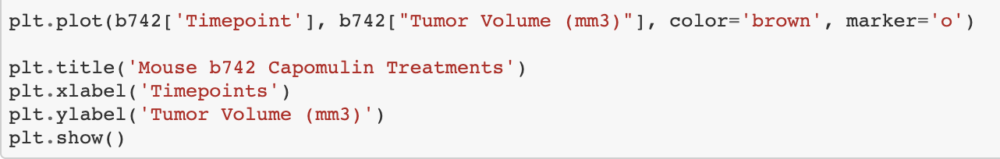
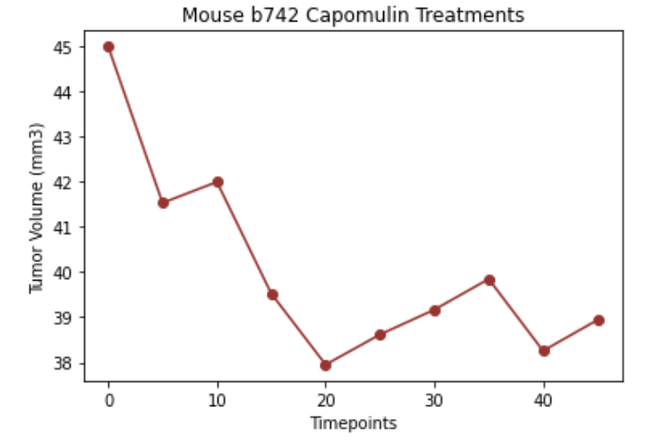
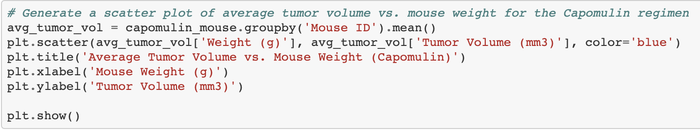
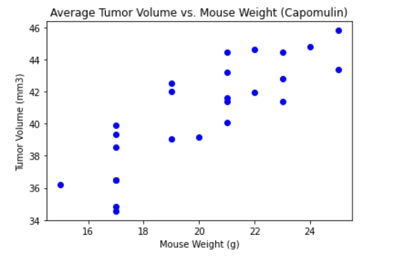
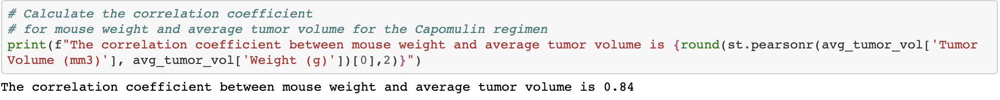
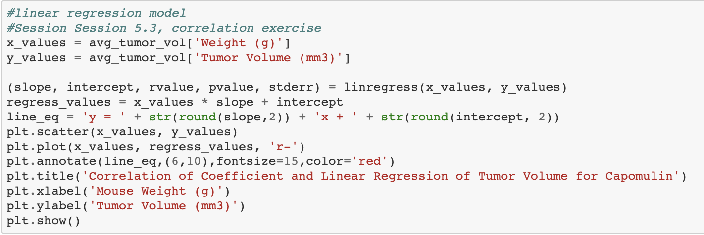
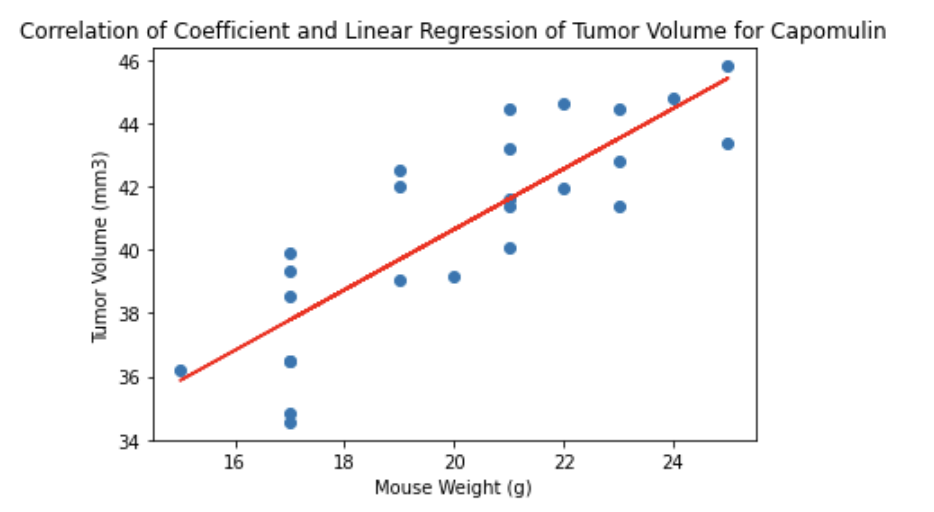

In this hypothetical study, 249 mice identified with SCC tumor growth were treated through a variety of drug regimens. Over the course of 45 days, tumor development was observed and measured. The purpose of this study was to compare the performance of Pymaceutical's, a fictional pharmaceutical company, drug of interest, Capomulin, versus other treatment regimens. Included are tables and figures needed for the technical report of the study, as well as a top-level summary of the study results.

The first step in the study was to merge the data from multiple data sets.

  

Once the data sets were merged, the data was checked for any mouse ID with duplicate time points.  It was found that mouse ID g989 had multiple time points listed, so data associated with that mouse ID was removed.  A check for the mouse count before and after the merge was conducted to ensure the data had been removed.  

  

   

   

Once the clean data frame was created, using the groupby method, a summary statistics table consisting of the mean, median, variance, standard deviation, and SEM of the tumor volume for each drug regimen was produced.

  
  

Matplotlib's pyplot was used to show the total number of measurements taken for each treatment regimen throughout the course of the study.

  

A pie plot was generated Pandas's DataFrame.plot() that shows the distribution of female or male mice in the study.

  

Next, the final tumor volume of each mouse across four of the most promising treatment regimens were analyzed.  These were: Capomulin, Ramicane, Infubinol, and Ceftamin.  To determine if there are any potential outliers across all four treatment regimens, the quartiles and IQR were quantitatively calculated.

  

Using Matplotlib, a box and whisker plot was created of the final tumor volume for all four treatment regimens and potential outliers were identified.

   

To gain further insights into the effects the Capomulin regimen had on tumor treatment, a mouse that was treated with Capomulin was selected the following visuals were created:  

- <strong> A line plot of tumor volume vs. time point for that mouse.</strong>

  
   

- <strong> A scatter plot of mouse weight versus average tumor volume. </strong>

  
   

- <strong> The correlation coefficient and linear regression model between mouse weight and average tumor volume for the Capomulin treatment. </strong>

  
   

  

<strong>From the data observed, the following can be inferred:</strong>

<ol>
  <li>The drug regimens with the highest measurement counts were Capomulin and Ramicane.</li>
  <li>The mice with the largest tumors and most metastic sites were those given a regimen of placebo drugs.</li>
  <li>The correlation coefficient between mouse weight and average tumor volume is 0.84, suggesting the two measurements are highly         correlated.</li>
</ol>
